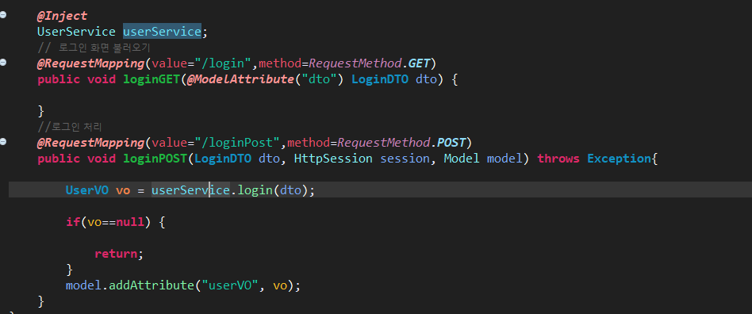
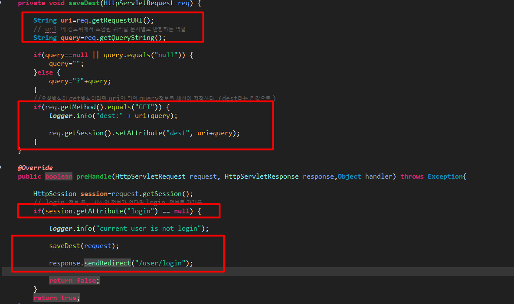
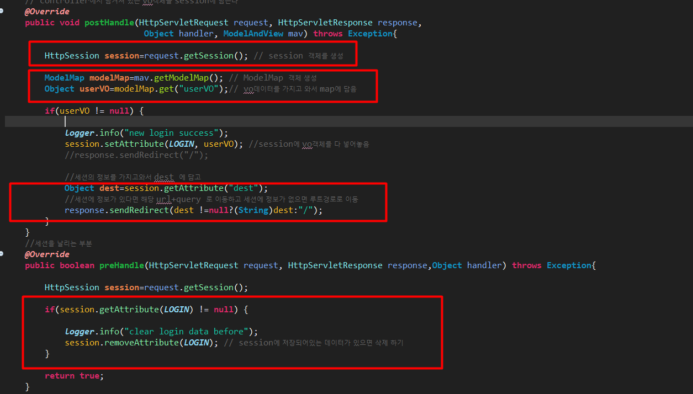
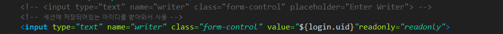
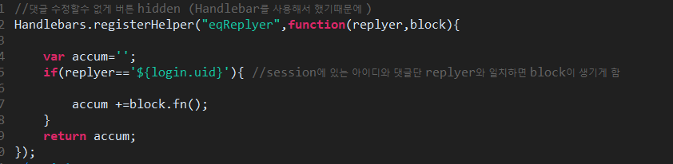
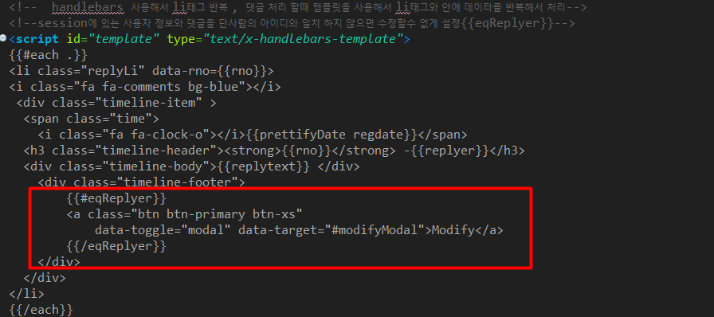
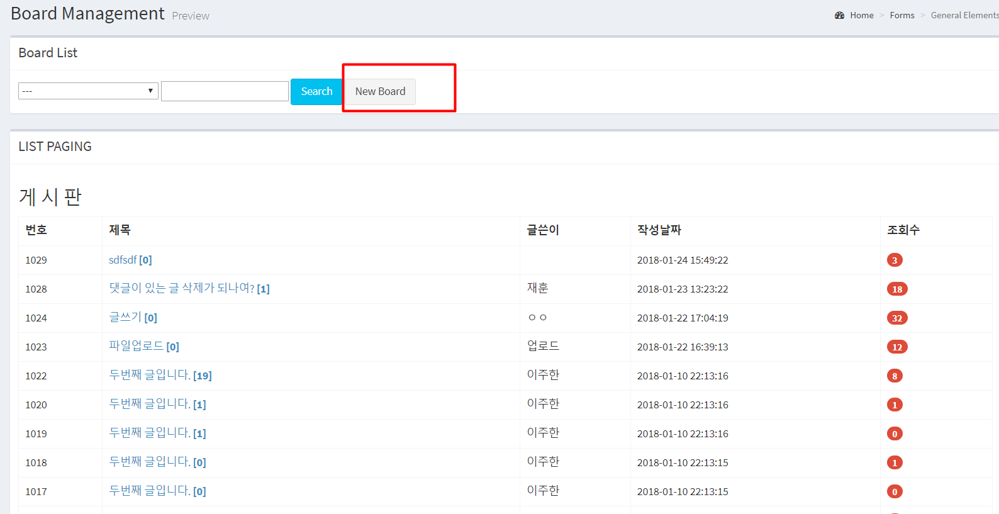
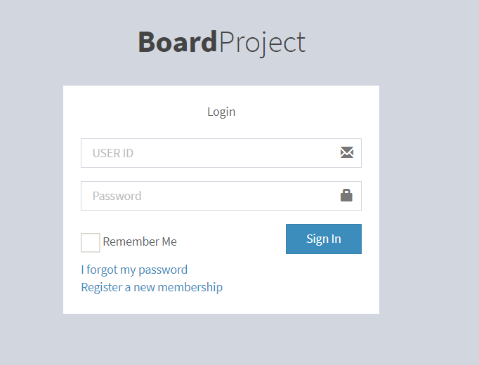
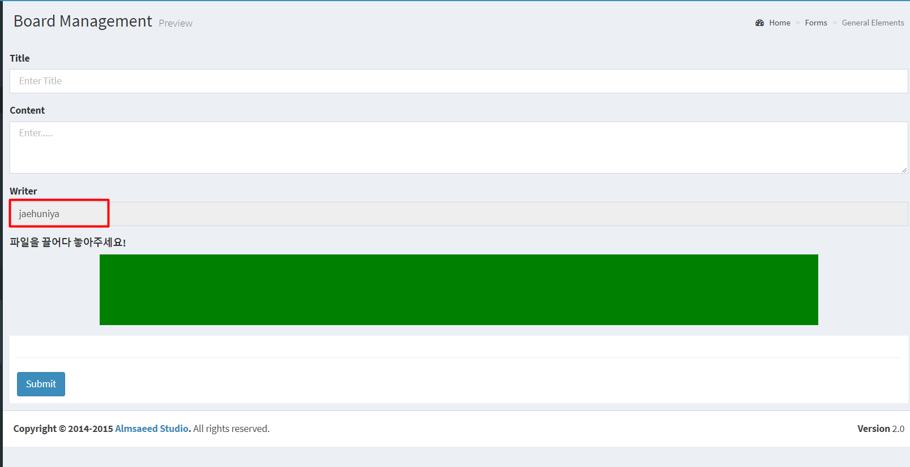
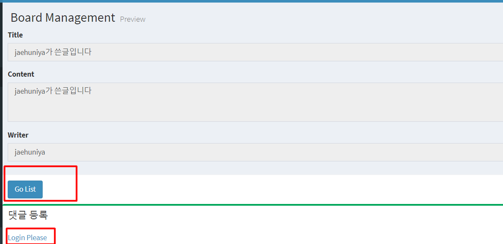

Login &
privacy restriction(Intercepter)
===

* ### Controller
  
  컨트롤러에서 세션처리를 하지 않고  Intercepter에서 PostHandle 을 이용해서 서블릿에 전달하기 전에 Session정보를 넣어서 servlet에 보낸다.
* ### AuthInterceptor
  
    1. AuthInterceptor 의 경우는 사용자가 가자고했던 uri를 저장했다가 로그인 후에 해당 페이지로 이동하는 역할을 하게 됨.
    2. 해당 uri와 뒤에 query문을 session 에 "dest"라는 키값으로 삽입,  
    saveDest 함수의 역할은 사용자가 원하는 URI가 무엇인지를 보관했다가 로그인 하면 해당 페이지로 이동하는 함수.
    3. preHandle(): 컨트롤러가 실행되기 전에 가로채는 Interceptor로 현재 session에 담긴 데이터가 없으면 sendRedirect를 login으로 가게 처리
* ### LoginInterceptor
  
  * **postHandle():** controller 실행후 실행되는 Interceptor
    1. Session 객체를 생성
    2. ModelMap객체를 생성
    3. Session 객체에 VO 객체를 삽입?넣어줌
    4. AuthInterceptor 에서 session에 담았던 dest(uri+query)정보를 가져와서 Object타입의 dest에 담고 session에 정보가 있다면 해당 처음 가려했던 uri로 가고 session에 정보가 없다면 "/"(root)로 가게 처리.
  * **preHandle():** contrller 실행전에 실행되는 Interceptor로 동작 이전에 session에 데이터 가 저장되어있으면 세션을 지우는 부분.
  ---
* ### JSP
  **regisger.jsp**
  
    사용자를 직접입력하지 않고 session을 이용해서 현재 로그인한 사용자 정보 받아오기
  **readPage.jsp**
  
  헬퍼함수를 등록하고(Handlebars.regisgerHelper) 그 안의 첫번째 파라미터("eqReplyer")는 함수의 이름이고, function이후는 사용될 함수의 파라미터.
  replyer==세션의 저장되어있는 아이디가 동일하다면 Modefiy버튼 활성화.
  

  ---
* ### View
  * #### 로그인 안했을때
  
  **[글쓰기] 버튼을 눌렀을시!**
  
  **로그인 화면으로 이동~**
  
  **로그인하면 내가 원했던 url로 이동 (AuthIntercepter 에서 처리한 uri+query 저장한부분)**
  
  1. session 즉 로그인한 사람과 글쓴 사람이 일치 하지 않거나 로그인을 하지 않으면  수정 삭제 불가능
  2. 댓글을 등록 할수 없어서 로그인 화면으로 가는 a태그 추가
  ---

  ### p.s
    * 인터셉터의 경우는 Repository 에 SpringStudy 에 예제를 통해서 정리해놓은것이 있으니 그쪽을 보면 더 이해하기 쉬울수 있다.
    * 오류: 하면서 오류 난것은 Session을 사용해서 사용자 id를 즉 uid를 받아오는데 어처구니 없이 JSP에서 **<%@ page session="false" %>** 부분을 삭제 하지 않아서 log쪽에서는 오류가 없어서 많이 고생했다. 명심하자~! session을 사용할려면 이부분을 없애야 사용할 수 있다.
