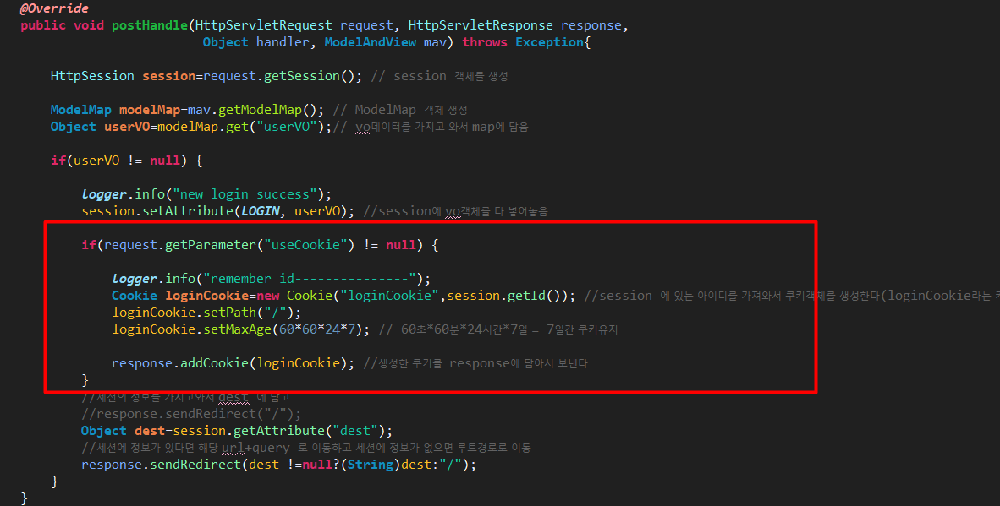
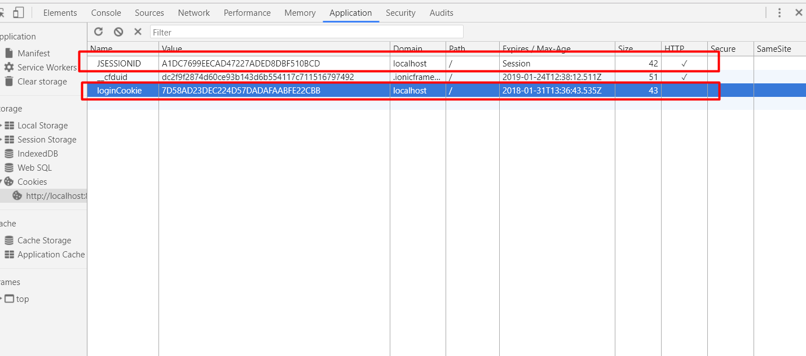
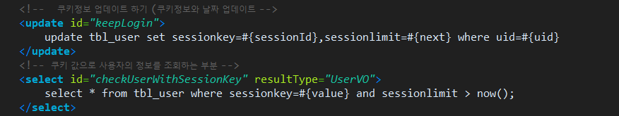
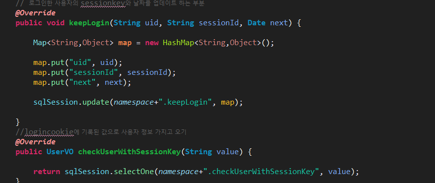
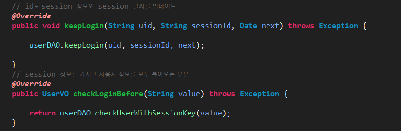
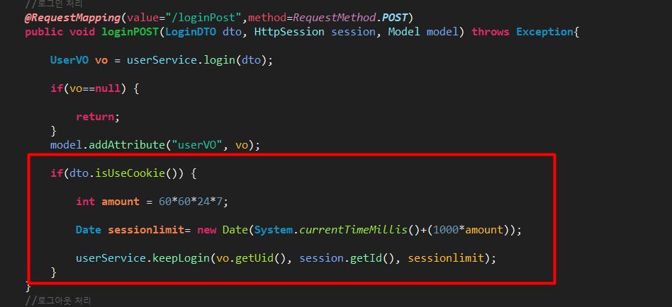
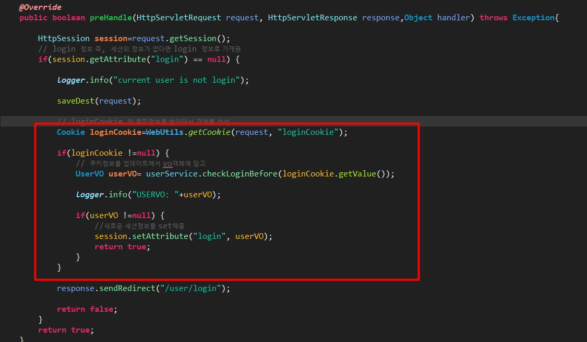

Auto Login
===
* HttpSession 에서 사용하는 Cookies 와는 달리 개발자가 만들어 낸 쿠키는 만료시간 즉, session이 유지되는 시간을 조정할수 있기 때문에 오랜기간 보존이 가능하다.
*  세션은 브라우저를 닫으면 정보가 날아가기 때문에 다시 로그인을 하는 번잡스러운 경우가 생긴다. 하지만 보안상으로는 서버의 내부에서만 작동되기때문에 보안상 유리한 점은있다 . 반대로 쿠키는 브라우저와 서버간에 계속 주고받는 형식을 가지고 있기 때문에 보안상 취약하다고 할수 있다.
보안에 취약한데 쿠키를 이용한 자동 로그인이 유행하게 된 계기는 모바일이 큰 역할을 하게 된다. 모바일의 경우 매번 앱을 닫고 다시 로그인하는 번잡스러운 상황을 없애기 위해서 쿠키를 이용한 자동 로그인을 많이 활용하는 추세이다.
  ---
  * #### Cookie 정보 수집
    **1. LoginInterceptor**
    
    1. 파라미터로 userCooki(header에  name값으로 되어있음 ) 를 받아와서 null이 아니라면 현재 세션의 uid를 받아와서 loginCookie에 담는다.
    2. 쿠키의 경로와 최대 얼마간 유지시켜줄지 잡아준다.(setPath, maxAge)
    3. 마지막으로 서버에 쿠키정보를 추가해서 보내주면 된다. (addCookie)

    **2.쿠키생성 확인**
    
    맨위에 있는 세션말고 밑에 개발자가 만든 cookie에 대한 정보를 볼수 있다.

    ___
  * #### Session 과 Cookie 동시 사용
    **1.HttpSession false, Cookie false:** 둘다 담겨져 있는정보가 없으므로 로그인 해야 하는상황
    **2. HttpSession true, Cookie false:** Session에는 정보가 있으므로 로그인이 되어있는 상태
    **3.HttpSession false, Cookie ture:** Cookie에만 정보가 있다는 것은 전에 로그인을 했다가 현재는 브라우저를 닫은 상태라 할수 있음 그리고Cookie 에 정보가 있다는 것은 최대 MaxAge를 7일로 잡아놨으니까 그전에 접속을 했다는 의미
    **4.HttpSession ture, Cookie true:** 현재 접속중인 사람
  ---
  * #### 수집한 Cookie 정보 활용해서 자동로그인 완성

    **1. Mapper**
    
    1. 로그인한 사용자 아이디와 일치하는 (uid) session의 정보와 쿠키정보제한기간(sessionlimit)에는 지금 날짜의 7일을 플러스한 값을 넣어준다.
    2.  현재 세션값으로 사용자의 정보를 조회

    **2. DAOImpl**
    
    uid,sessionid(세션정보), next(쿠키유지날짜) 를 map에 담아서 처리한다. next의 경우는 컨트롤러에서 계산하여 처리하는 부분이 있다.

    **3.ServiceImpl**
    
    Service쪽은 그냥 다오처리하는 부분으로 특별한 로직은 없다.
    **4. Controller**
    
    이부분이 next에 대한 처리부분으로 로그인 되어있는 현재 유저 아이디와  세션정보와 계산한 sessionlimit에 대한 정보를 가지고있음

    **5. AuthInterceptor**
    
    loginCookie를 가지고 있는지 체크해보고  만일 Cookie 정보가 있다면 UserVO userVO= userService.checkLoginBefore(loginCookie.getValue()); (즉, 쿠키정보를 가지고 사용자의 정보가 있는지 확인한다. ) 마지막으로 쿠키정보로 조회한 사용자의 정보가 있다면 그 사용자 정보를 Session에 다시 뽑아온 사용자의 정보를 set해준다.
    이부분은 현재 사용자가 로그인을 하지 않아서 session에 값이 존재 하지 않지만 쿠키가 존재할때 사용되는 부분이다. 
