게시판 업로드 적용시키기
===
* ### 데이터 베이스에 업로드 파일에 대한 기록 처리
  * form 데이터와 파일데이터를 구분해서 정송하는 방식 이용, 즉 파일은 별도로 업로드하고 데이텅베이스에 기록될 데이터는 나중에 전송하는 방식을 사용할 예정
---
* ### 게시물 등록준비
  * 사용자가 첨부팡일을 올릴경우 드래그-드랍으로 파일을 서버에 업로드 시키는 방식으로 할예정
  * 게시물 등록버튼을 이용해서 게시물을 등록하게함
---
* ### 파일 업로드된 파일명 처리 방법
  1. 서버에 업로드된 파일이름을 getFileInfo를 통해서 데이터 정보를 추출한한다.
  2. 추출한 정보로 javascript 객체를 생성
  3. handlebars 적용
  4. html적용
  5. 마지막으로 view에 적용한다.
---
* ### 상세조회 페이지에서 업로드한 파일 보는 방식
  * 글을 조회했을때 데이터베이스에서 조회한걸 가지고 Ajax를 이용해서 현재 게시물의 첨부파일을 별도로 가지고오는 방법사용
---
* ### Source & View(controller와 util파일은 springStudy와 동일 )

  * #### Mapper
    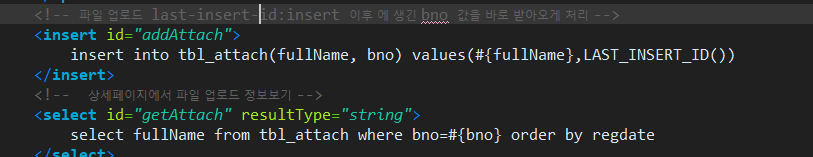
    Last_Insert_id(): insert 이후에 생긴 bno 값을 바로 받아오는 역할
    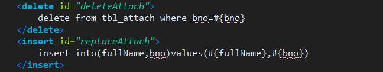
    수정의 경우 파일삭제 후 다시 등록처리를 함,
  * #### DAOImpl
    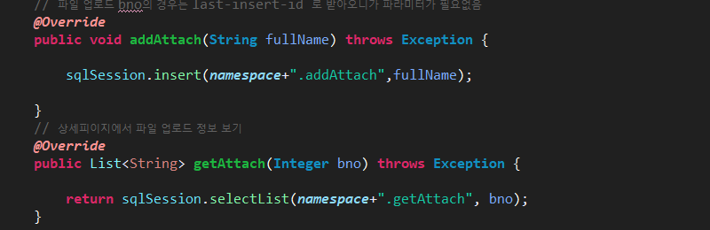
    파일 업로드 부분에서 bno를 파라미터에 넣지 않은이유는 mapper에서 보면 insert 할때에 Last_Insert_id 해서 bno를 넣어주기 때문에 (auto_increamnet와 비슷한 역할)
    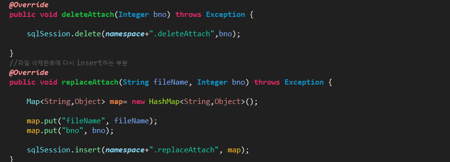
    두개의 파라미터가 필요하기 때문에 map에 담에서 처리.
  * #### ServiceImpl
    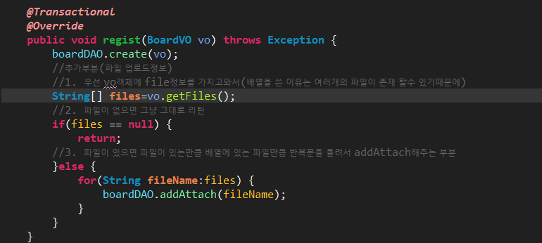
    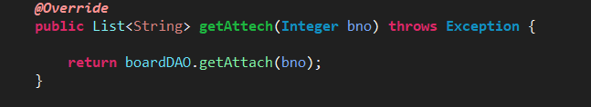
    파일을 업로드할때에는 먼저 게시글을 추가 시킨후에 파일에 대한 정보를 업로드 하는 형식으로 처리 했고, vo객체에 있는 file을 가지고와서 배열에 넣어준다. 그후에 파일이 있는지 없는지 if문을 통해서 검사하고 파일이 있는만틈 fileName에 집어넣어주고 addAttach 해준다.
    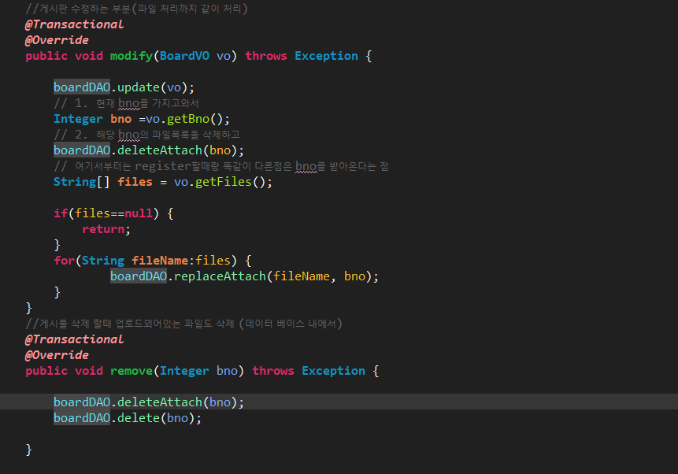
    게시판을 수정할때에 우선 게시글에 대한 수정처리를 먼저 한후에  현제 vo객체에 담겨져 있는bno를 받아와서 삭제처리를 먼저한후에 첨부파일에 대한 추가 처리를 하게된다. vo객체에 있는 파일정보를 받아와서 파일이 없다면 그냥 리턴 해주면 되고, 파일이 있다면 파일 수만큼 반복해서 insert 해주면 된다.  삭제의 경우는 먼저 첨부파일을 삭제한후에 게시글 삭제 처리가 이루어져야 된다. 이유는 게시물의 bno를 첨부파일의 bno가 참조하고 있기때문에 반대로하면 참조키에 대한 오류가 생긴다.
  * #### Controller
    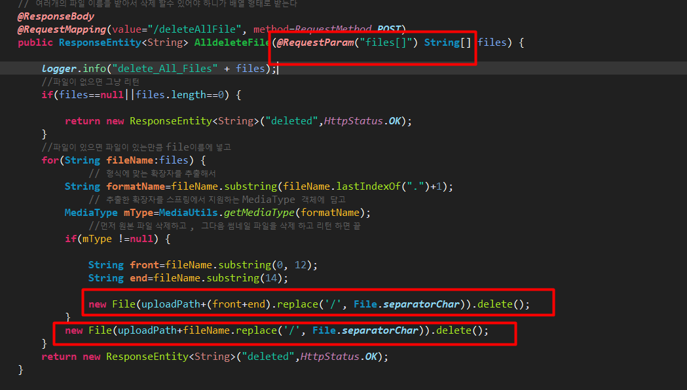
      1. 파라미터로 RequestParam을 사용해서 배열형태의 file을 전부 받아온다. (log를 찍업면 현재 배열의 존재하는 파일들이 나올 것이다.)
      2. 파일이 없으면 그냥 그냥 그대로 삭제 처리 하게 되고
      3. 파일이 존재한다면 이미지 파일일 경우 먼저 원본 파일을 삭제 하고
      4. 후에 썸네일 파일을 삭제 하게 된다.
  * #### view(register)
    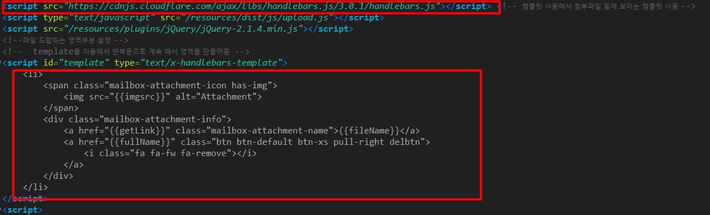
    Handlebar 템플릿을 사용해서 처리를 했는데 이 템플릿의 역할은
    1. 템플릿 핸드바를 가지고 온다.(위의 소스중에 회색부분)
    2. 템플릿 핸드바를 컴파일 한다.
        * var template=Handlebars.compile($("#template").html()); 이부분의 1,2번에 해당됨
    3. 데이터 바인딩(search.md에 바인딩에 대한 설명을 해놓았음)
    4. DOM 객체에 추가하기
        * $(".uploadedList").append(html);부분임

    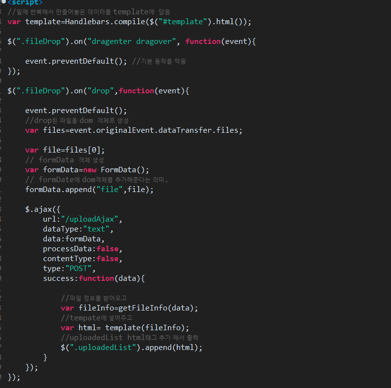

    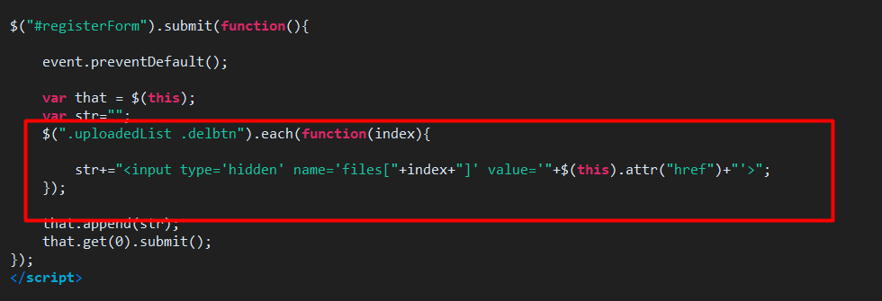
    업로드 된후 "x" 를 누르면 업로드한 파일을 삭제하게끔 처리
  * #### view(delete)
    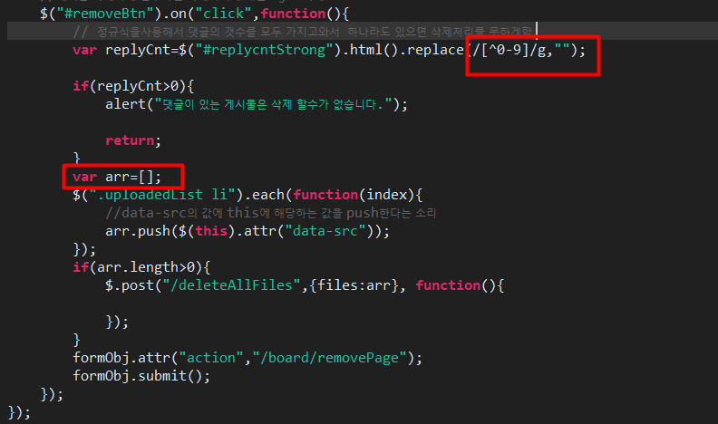
    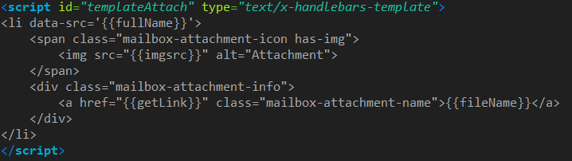
      1. 게시글 삭제버튼을 클릭시에 댓글 모두 삭제가 되어야 하기 때문에 모든 댓글의 수를 정규식으로 가지고와서 댓글이 있을시에는 삭제를 못하게 막음
      2. 댓글이 없을시에는 첨부파일 정보를 배열(arr[])에 담아서 컨트롤러에 보내서 먼저 첨부파일을 삭제한후에 게시글을 삭제하게끔 한다.
      3. **attr.push():** 예를들어서 arr = [1,2,3,4,5]의 배열 이 있다면 arr.put(7) 이런식으로 하면 배열의 마지막값에 7이 들어간다는 의미
      4. **attr(attribute,value) :**  value 값으로 대체한다는 의미로  attr("a href", "board") 이런식으로 하면 a href="board" 로 바뀐다는 의미

---

* ### 오류와 해결 방법
  * hadlebar 을 못잡아줄때  생기는 오류
    * **You must pass a string or Handlebars AST to Handlebars.compile. You passed undefined**
  * 해결방법
    * **var template=Handlebars.compile($("#templateAttach").html());**
    이부분을 제일 밑으로 잡아준다.
